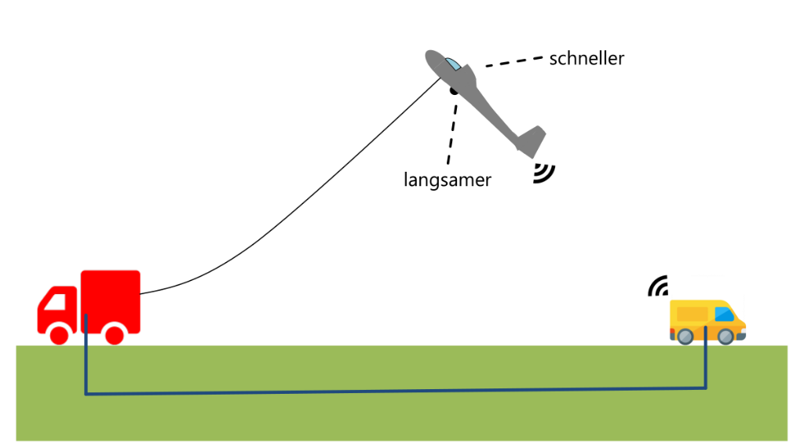

# Windenstarthelfer (WSH)

**Projekt zur Ermittlung der Seilkraft im Windenstart durch ein mobiles Endgerät**

An Android application for calculating cable forces during glider winch launches using smartphone sensors.



---

Short clip, that showcases some functions of the Android Application `Windenstarthelfer (WSH)`


## Overview

This project was developed as a research project at the **Institut für Technische Mechanik** under the supervision of **Prof. Dr.-Ing. habil. Gunther Brenner** by **Robert-Vincent Lichterfeld**.

The app uses built-in smartphone sensors to record flight data during winch launches and calculates the cable force based on aircraft characteristics and environmental conditions.

### Project Work

[Concept for determining cable tension during winch launches using a mobile device](./docs/WSH_Presentation_PA_EXTnoMov.pdf)

## Features

### Sensor Data Recording
- **Linear Acceleration** - Records acceleration data during takeoff
- **Positioning** - GPS/GLONASS for location and altitude tracking
- **Air Pressure** - Barometric pressure for altitude determination

### Aircraft Data Management (Flugzeug)
- Aircraft profile data (e.g., ASK 13)
- Profile segment analysis (GOE535 airfoil)
- 3D modeling and ANSYS flow simulation
- Lift and drag coefficient calculations

### Winch Parameters (Winde)
- Winch force calculations
- Cable force modeling with wind influence
- Logarithmic wind profile consideration

### Calculations
- Simplified replacement model for aircraft during roll and takeoff phases
- Cable force calculation with compact equation
- Wind influence compensation
- Sensitivity analysis

## Project Structure

```
Windenstarthelfer/
├── app/src/main/java/com/example/l520/wsh_0_003/
│   ├── MainActivity.java          # Main activity
│   ├── Flugzeug.java              # Aircraft data management
│   ├── Winde.java                 # Winch parameter management
│   ├── SensorActivity.java        # Sensor data display
│   ├── RecDataActivity.java       # Data recording functionality
│   ├── LocationActivity.java      # GPS location tracking
│   ├── AboutActivity.java         # About the project
│   └── SplashScreenActivity.java  # App splash screen
├── docs/
│   └── WSH_Presentation_PA_EXTnoMov.md  # Project presentation
└── build.gradle                   # Gradle build configuration
```

## Technical Details

### Minimum Requirements
- Android device with:
  - Accelerometer sensor
  - GPS receiver
  - Barometer (air pressure sensor)
- Android permissions:
  - `ACCESS_COARSE_LOCATION`
  - `ACCESS_FINE_LOCATION`
  - `WAKE_LOCK`
  - `WRITE_EXTERNAL_STORAGE`

### Architecture
- **Package:** `com.example.l520.wsh_0_003`
- **Min SDK:** Configured in Gradle
- **Version:** 0.004

## Background

### Winch Launch Process
During a winch launch, a glider is pulled by a cable connected to a ground-based winch. The cable force is a critical parameter for flight safety. This app provides a mobile solution to:

1. Record sensor data during the launch
2. Calculate the cable force in real-time
3. Display recorded data for analysis
4. Support sensitivity studies for safety margins (e.g., cable breaking force)

### Prototype Hardware
In addition to the smartphone app, a prototype tension measuring device was developed using an **OAK microcontroller** that communicates via **JSON** for digital force values.

## References

- **Airfoil Data:** GOE535 profile analysis
- **Aircraft Model:** ASK 13 glider
- **CFD Simulation:** ANSYS-based flow simulation
- **Validation:** Comparison with XFLR5 software results

## License

See [LICENSE](LICENSE) file for details.

## Authors

- **Robert-Vincent Lichterfeld** - Project developer
- **Prof. Dr.-Ing. habil. Gunther Brenner** - Supervising professor

**Institut für Technische Mechanik**  
Technische Universität / University

*Project dated: May 18, 2017*
