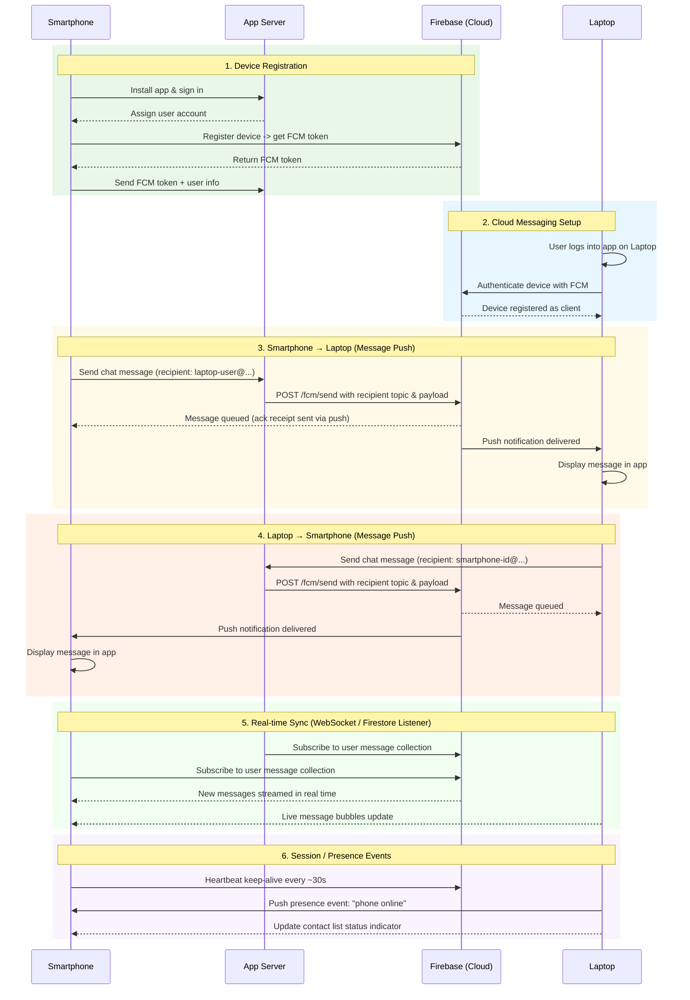

# Cloud Messaging Sequence Diagram

Communication flow between Smartphone and Laptop via Firebase Cloud Messaging (FCM).

## Overview

| Phase | Description |
|-------|-------------|
| **Device Registration** | Smartphone installs the app, registers with Firebase, and stores its FCM token on the App Server. The Laptop does the same when the user logs in there. |
| **Cloud Messaging Setup** | Both devices authenticate with Firebase so they can receive push notifications. |
| **Smartphone → Laptop** | When the Smartphone sends a message, the server posts to the FCM endpoint; Firebase delivers the push notification to the Laptop. |
| **Laptop → Smartphone** | The reverse path: the Laptop's messages flow through Firebase to reach the Smartphone in real time. |
| **Real-time Sync** | A WebSocket or Firestore listener keeps both devices' message collections synchronized without polling. |
| **Session / Presence Events** | Heartbeat and presence notifications maintain an up-to-date contact list indicator. |