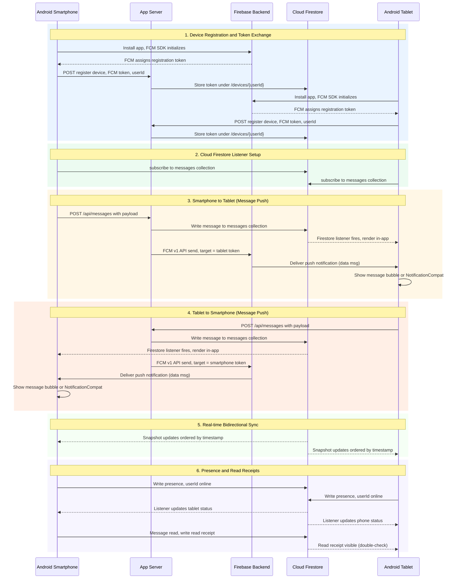

# Cloud Messaging Sequence Diagram

Near real-time communication and data flow between an **Android Smartphone** and an **Android Tablet** via Firebase Cloud Messaging (FCM) HTTP v1 API, Firestore listeners, and device-to-device sync.



## Overview

| Phase | Description |
|-------|-------------|
| **1. Device Registration** | Each Android device initializes the FCM SDK, receives a unique registration token, and registers that token with the App Server which stores it in Firestore. Tokens are refreshed on app install or re-opt-in. |
| **2. Firestore Listener Setup** | Both devices subscribe to the same Firestore collection (`/messages/{chatId}`), creating persistent WebSocket connections for near real-time document change events without polling. |
| **3. Smartphone → Tablet** | The smartphone sends the message to the App Server, which (a) writes it to Firestore and (b) triggers a data-only FCM push via the HTTP v1 API to the tablet's token. If the tablet app is in the foreground, the Firestore listener delivers the message directly; if in the background, the system notification bar wakes the user. |
| **4. Tablet → Smartphone** | The symmetric reverse path — same dual-write (Firestore + FCM push) ensures delivery regardless of the recipient's app state. |
| **5. Real-time Sync** | Firestore snapshot listeners on both devices keep all message bubbles synchronized with server timestamps as the source of truth, providing consistent ordering across devices. |
| **6. Presence & Read Receipts** | Each device publishes its online status to a `/presence` document and writes read receipts into individual message documents. The counterpart listener shows up-to-date availability indicators and delivery/read confirmations. |

## Architecture Notes

- **FCM HTTP v1 API** (`POST fcm.googleapis.com/v1/PROJECT/messages:send`) is the current standard — legacy Server Key API was deprecated in June 2024.
- **Data-only messages** are preferred for chat payloads; notification messages can be used when a visual system banner is desired on its own.
- When the app is in the **foreground**, `FirebaseMessagingService.onMessageReceived()` fires with the full data payload. In the **background**, Android routes the message to the system notification tray (NotificationCompat). Tapping the notification opens the app, which then syncs from Firestore.
- A dual-write pattern (Firestore + FCM push) guarantees delivery: Firestore provides ordered, queryable history; FCM provides instant wake-up for background devices.

## Key Sequence (Textual)

```
Smartphone → App Server → Firestore (persist) + FCM (push)
                               ↓                        ↓
                          Tablet listener        Tablet notification
                    (foreground: render         (background: system tray)
                       message immediately)
```
