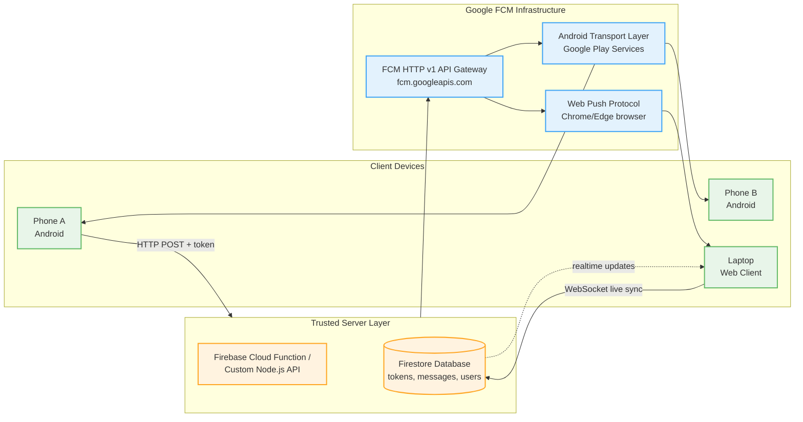
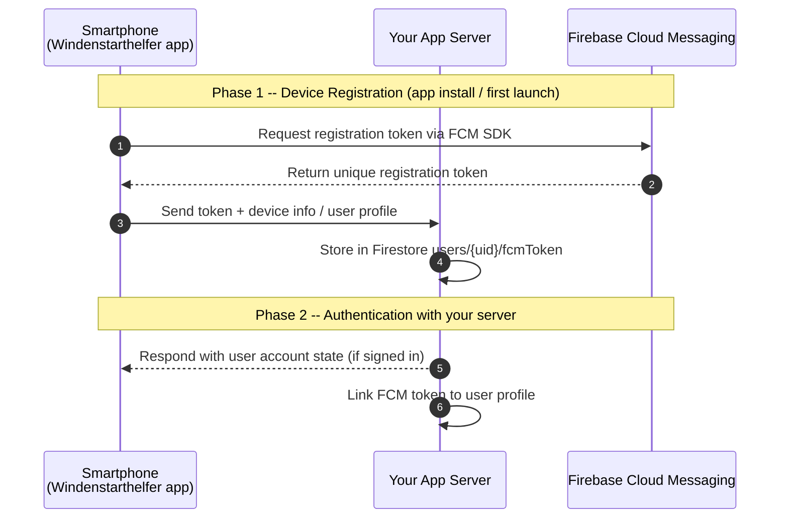
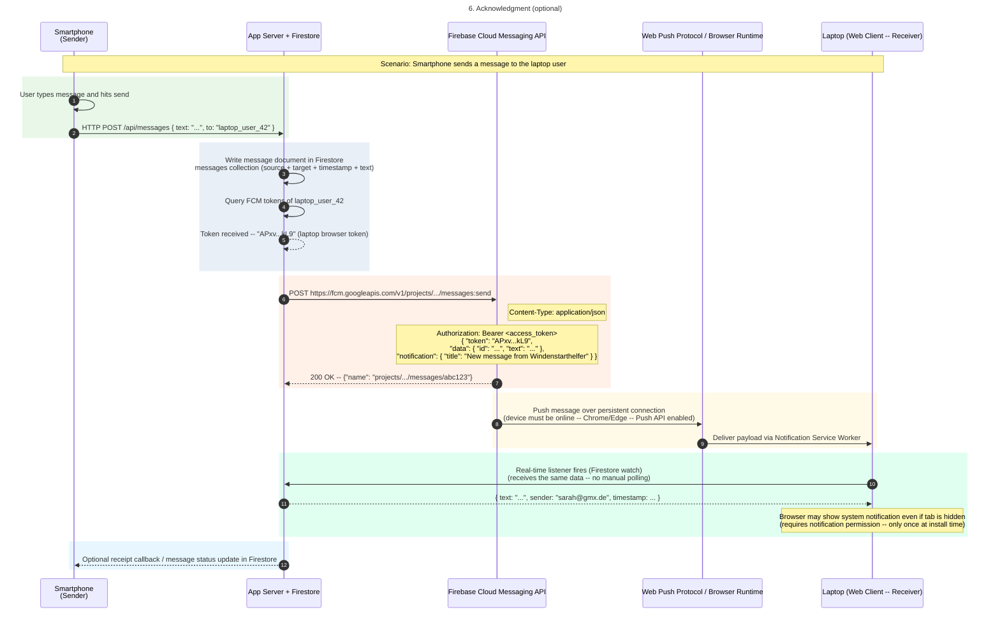
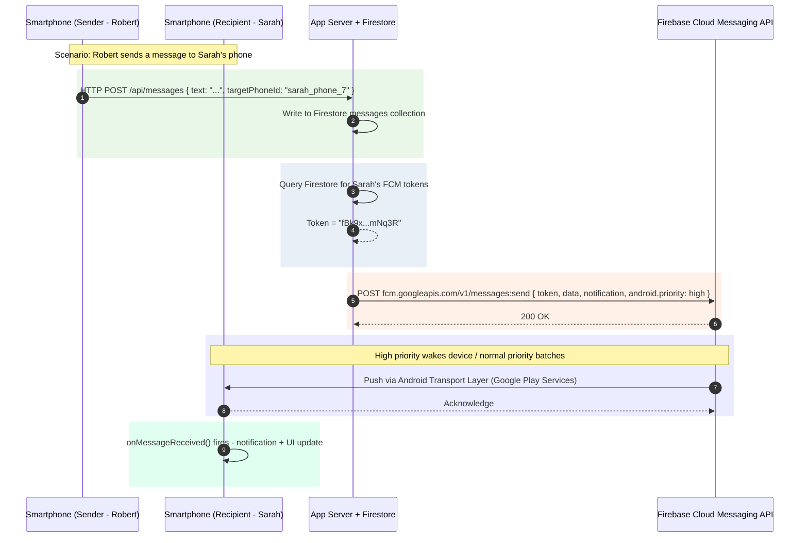
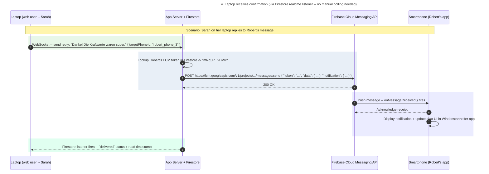

# Firebase Cloud Messaging — Architecture, Message Flow & Latency

**Communication via Firebase Cloud Messaging (FCM) for data exchange between a Windenstarthelfer Android Smartphone, a Laptop Web Client and/or another Android Smartphone.**

---

## 1. System Architecture Overview



---

## 2. Device Registration & Token Exchange

Before any messaging can happen, every client device must register with FCM and exchange its token (unique identifier) with the App Server.



**What this achieves:** The App Server now has the unique address (token) that Firebase needs to deliver messages back to this specific device. The same registration process runs on any second smartphone or a web browser laptop app -- each obtains its own distinct FCM token.

---

## 3. Message Delivery Sequence -- All Scenarios

### 3A. Scenario: Smartphone A -> Laptop (Phone Sends a Message)



### 3B. Scenario: Smartphone -> Another Smartphone (Device-to-Device)



### 3C. Scenario: Laptop -> Smartphone (Reverse Direction)



---

## 4. Timing / Latency Breakdown by Device State

| **Device state** | **Normal priority** | **High priority** |
|---|---|---|
| Screen on / app active | Near-instant (~1-3 s end-to-end) | Near-instant (~1-3 s end-to-end) |
| App backgrounded | Seconds to minutes (may be batched) | Near-instant (~1-3 s end-to-end) |
| Device in doze mode | Can be delayed significantly (minutes -- delivery is opportunistic) | Delivered immediately, device can be woken up |
| Device offline | Queued for up to 28 days (TTL), delivered when back online | Same behavior -- FCM attempts immediate delivery once the device reconnects |

### End-to-end latency composition

| **Step** | **Description** | **Typical latency** |
|---|---|---|
| Sender -> your server | HTTP request over mobile/wifi network | ~50 ms - 3 s (network dependent) |
| Server processing & database write | Firestore document write + query | ~10 ms - 500 ms (hosted service) |
| Server -> FCM API | HTTP v1 API call to fcm.googleapis.com | Usually < 1 s |
| FCM delivery to target device | Transport layer delivers over open connection | Seconds if online; hours if offline and queued |
| Device receives & displays payload | OS/browser processes and shows notification | Near-instant once arrived via transport |

**Total round-trip latency:** roughly **1-3 seconds** when the entire chain is active and online.

### Factors that add delay

- **Doze mode** (Android) -- major cause of delayed delivery for normal-priority messages; device enters battery-saving sleep when screen is off
- **Message priority** -- `normal` vs `high`; always use `high` for time-sensitive communication
- **Collapsing** (`collapseKey`) -- newer identical messages replace older ones in the queue (can appear as a delay)
- **TTL (time-to-live)** -- message age at which FCM discards it; default 28 days, set to `0` for "now or never"
- **Transport differences** -- Android devices use Google Play Services' ATP; web browsers use the Push API (different protocols but comparable performance)

---

## 5. Code Reference Snippets

### Sending a high-priority message from your server

```javascript
// Node.js + Firebase Admin SDK
import admin from 'firebase-admin';

async function sendMessage({ recipientToken, text }) {
  const response = await admin.messaging().send({
    token: recipientToken,
    data: { text, type: 'message' },
    notification: {
      title: 'Neue Nachricht',
      body: text.substring(0, 80),
      icon: '/icons/icon.png',
      badge: '/icons/badge.png',
    },
    android: { priority: 'high' },
    apns: { payload: { aps: { sound: 'default' } } },
    webpush: { headers: { Urgency: 'high' } },
  });
  console.log('Delivered:', response);
}
```

### Receiving messages on Android (in the Windenstarthelfer app)

```kotlin
class MyFirebaseMessagingService : FirebaseMessagingService() {
    override fun onMessageReceived(remoteMessage: RemoteMessage) {
        // Show system notification
        remoteMessage.notification?.let { n ->
            showNotification(n.title ?: "Neue Nachricht", n.body ?: "")
        }
        // Store message text in app-local UI state
        val text = remoteMessage.data["text"] ?: ""
        EventBus.getDefault().post(MessageReceivedEvent(text))
    }
}
```

### Web browser client receiving messages on laptop

```javascript
// In your web app entry point
import { getMessaging, getToken, onMessage } from 'firebase/messaging';
const messaging = getMessaging(app);

onMessage(messaging, (payload) => {
  document.getElementById('chat').innerHTML += `<p>${payload.data.text}</p>`;
});

getToken(messaging, { vapidKey: 'YOUR_VAPID_KEY' }).then((token) => {
  fetch('/api/register-token', {
    method: 'POST', headers: { 'Content-Type': 'application/json' },
    body: JSON.stringify({ token }),
  });
});
```

---

## Summary

| Aspect | Key takeaway |
|---|---|
| **Architecture** | All messaging flows through your server -> FCM API -> Android Transport Layer / Web Push Protocol. There is no direct peer-to-peer path. |
| **Latency when online & high priority** | ~1-3 seconds end-to-end. |
| **Doze mode effect** | The single largest source of latency -- use `high` priority for time-sensitive communication. |
| **Payload limit** | Data messages carry up to 4 KB (32 key-value pairs, 8 KB per value). |
| **Message expiration** | Set `ttl: 0` for "now or never" delivery; default is 28 days of queuing while offline. |
